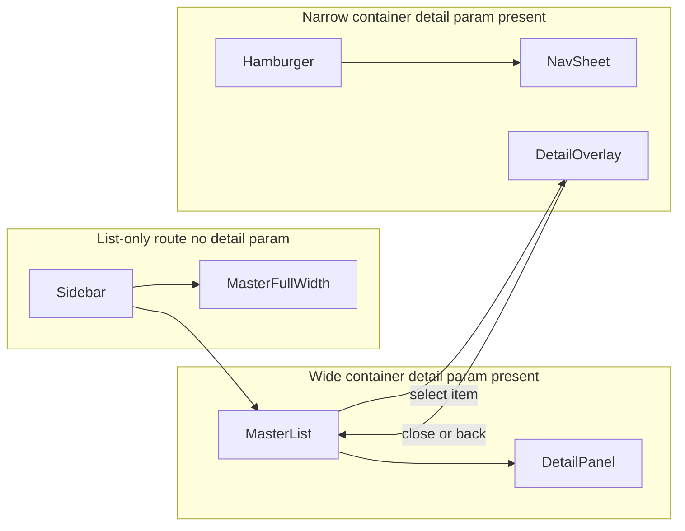
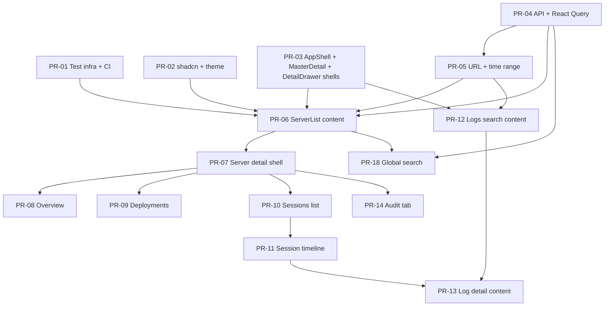

# Frontend — UI Architecture

Implementation blueprint for the MCP observability dashboard. Product and view requirements live in [SPEC.md](./SPEC.md). API shapes are documented in [API.md](../API.md).

**Agent guidelines:** [AGENTS.md](../AGENTS.md) consolidates coding conventions, quality bar, and architecture rules for consistent implementation (human and AI).

**Starting point:** [src/main.tsx](../src/main.tsx) (placeholder route), [vite.config.ts](../vite.config.ts) (dev server on port 3000, `/api` proxied to port 3001), [src/lib/utils.ts](../src/lib/utils.ts) (`cn()` helper already present for shadcn).

---

## 1. Goals and layout model

### 1.1 Purpose

Build a read-only observability dashboard that helps developers answer: Is my MCP server healthy? What broke? Where in the session flow did it fail? What changed?

Navigation stays shallow at the top level; depth comes from drill-down inside views — master/detail for servers and logs, plus a third-level `DetailDrawer` for deployment and session drill-down — not from adding sidebar items.

### 1.2 App shell

The application uses a persistent **AppShell** that spans the **full width of the browser** — no `max-w-`\* cap on the app root. Wider viewports expose more horizontal space for master/detail panes and inner grids; content reflows responsively rather than centering in a fixed-width frame.

```
┌──────────────────────────────────────────────────────────────────────────┐
│ [≡]  Dashboard        [Global search — PR-18]           [Time range ▼]   │
├──────────┬───────────────────────────────────────────────────────────────┤
│          │                                                               │
│ Sidebar  │  Main content area (MasterDetailLayout)                       │
│ ~236px   │  Servers: / and /servers/*  ·  Logs: /logs and /logs/:logId   │
│ Servers  │                                                               │
│ Logs     │                                                               │
│          │                                                               │
└──────────┴───────────────────────────────────────────────────────────────┘
```

Layout grid: `sidebar (fixed ~236px) + main (flex-1 min-w-0)`. The topbar reserves space for a future **global server search** (PR-18, nice-to-have).

### 1.3 Primary navigation (sidebar)

| Label   | Route   | Role                                              |
| ------- | ------- | ------------------------------------------------- |
| Servers | `/`     | Home dashboard — server inventory and entry point |
| Logs    | `/logs` | Global log search and error hunting               |

`/` is the home dashboard route. The nav label is **Servers**, not "Dashboard".

On **≥ `lg` (1024px):** sidebar is always visible (~236px fixed width).

On **< `lg`:** sidebar is hidden. A hamburger button in the **top-left of the AppShell header** opens a shadcn **Sheet** with the same nav links. Selecting a link closes the sheet.

### 1.4 Unified master/detail pattern (Servers and Logs)

Both **Servers** and **Logs** use the same shared `MasterDetailLayout` component with responsive split/overlay behavior driven by **container queries**, not JavaScript viewport checks.



| Area    | Master (list-only route) | Detail route           | Detail param | Close detail →           |
| ------- | ------------------------ | ---------------------- | ------------ | ------------------------ |
| Servers | `/`                      | `/servers/:serverId/*` | `serverId`   | `/` (preserve query)     |
| Logs    | `/logs`                  | `/logs/:logId`         | `logId`      | `/logs` (preserve query) |

| Container width (inside main area) | Master visible              | Detail visible   | Behavior                                                     |
| ---------------------------------- | --------------------------- | ---------------- | ------------------------------------------------------------ |
| List-only route (no detail param)  | Yes, **full width** of main | **Not rendered** | No detail pane or empty placeholder — master fills main area |
| Detail param present, wide         | Yes (~40% fluid)            | Yes (~60% fluid) | Side-by-side split; panes grow with viewport                 |
| Detail param present, narrow       | Hidden                      | Yes, full width  | Detail overlays master; back/close clears detail route       |

**List-only routes (`/` and `/logs`):** the detail pane is **not mounted**. Do not show an empty-state placeholder in a permanent detail column on wide screens.

**Desktop split (when detail param present):** master ~40% / detail ~60% (fluid `minmax()` — no fixed pixel cap on pane max-width). Use shadcn `ScrollArea` on each pane to prevent overflow.

**Narrow container / mobile:** when a detail param is present, the master pane is hidden. The detail panel fills the main area with a header **back/close** control.

**Global query params on close:** preserve time-range params (`since`, `until`) when navigating back to the list route.

### 1.5 Logs area

Logs uses the **same** `MasterDetailLayout` as Servers (not a separate full-width-only layout):

- `**/logs`\*\* — master pane: log search list (placeholder in PR-03, real content in PR-12).
- `**/logs/:logId**` — master + detail on wide containers; detail overlay on narrow containers.
- Row click in log list → `/logs/:logId` (master stays visible on wide screens).
- Direct URL to `/logs/:logId` renders detail in the detail pane; list remains in master on wide containers.

Session timeline may link to `/logs/:logId` or open log detail within the logs master/detail context.

### 1.6 Server detail sub-navigation (tabs)

When a server is selected, horizontal tabs appear **below** the detail panel header (not in the sidebar):

| Tab         | Route suffix   | Purpose                  |
| ----------- | -------------- | ------------------------ |
| Overview    | `/overview`    | Health, stats, shortcuts |
| Deployments | `/deployments` | Versions, tool catalogs  |
| Sessions    | `/sessions`    | Sessions for this server |
| Audit       | `/audit`       | Governance timeline (P1) |

Hide or disable the **Audit** tab when `audit_enabled === false` on the server.

**`ServerDetailHeader` layout (do not change without explicit design review):**

- **No breadcrumbs** in the server detail panel. Context comes from the master list selection, the header title (`display_name`), and the close control — not a `Servers > …` trail.
- Header row: server name + description on the left, `DetailCloseButton` on the right (wide container).
- Below header: source metadata, governance summary, then tab nav in `ServerTabs`.

Drill-down routes (no new sidebar items):

| Route                                          | View                      | Container                        |
| ---------------------------------------------- | ------------------------- | -------------------------------- |
| `/servers/:serverId/deployments/:deploymentId` | Deployment detail + tools | `DetailDrawer` (right drawer)    |
| `/servers/:serverId/sessions/:sessionId`       | Session timeline          | `DetailDrawer` (right drawer)    |
| `/logs/:logId`                                 | Log detail                | `MasterDetailLayout` detail pane |

### 1.7 Three-level navigation (master → detail → drawer)

Servers use **three stacked navigation levels** — distinct from the top-level `MasterDetailLayout` used for server list + server detail and for logs:

```
┌──────────┬────────────────────────────┬─────────────────────────┐
│ Sidebar  │ Master (server list)       │                         │
│          │ full width when `/` only   │                         │
│          │ ~40% when server selected  │                         │
│          ├────────────────────────────┤  DetailDrawer           │
│          │ Detail (server tabs)       │  (deployment / session) │
│          │ only when server selected  │  ~35% or overlay        │
│          │ Overview · Deployments ·   │                         │
│          │ Sessions · Audit           │                         │
└──────────┴────────────────────────────┴─────────────────────────┘
```

| Level  | Component            | Wide container behavior                                                                   | Narrow container behavior                               |
| ------ | -------------------- | ----------------------------------------------------------------------------------------- | ------------------------------------------------------- |
| Master | `MasterDetailLayout` | Server list **full width** at `/`; ~40% of main area when `serverId` in URL               | Hidden when `serverId` is in URL (detail overlays)      |
| Detail | `ServerDetailPanel`  | Tab content visible (~60% of main area) when `serverId` in URL; not rendered on `/` alone | Full width of main area when `serverId` in URL          |
| Drawer | `DetailDrawer`       | Third column to the **right** of the tab content area; server list + tabs remain visible  | Overlays the entire main content area (master + detail) |

**Wide container:** clicking a deployment row or session row opens `DetailDrawer` beside the active tab — the server list stays in the left master pane and the server detail tabs (e.g. Deployments, Sessions) remain visible behind or beside the drawer. The drawer occupies the right portion of the detail pane area (fluid `minmax()`, not a fixed pixel cap).

**Narrow container:** `DetailDrawer` overlays the master view (server list and tab content are hidden underneath). A header **close/back** control dismisses the drawer.

**Close drawer:** navigate to the parent tab route (`/servers/:serverId/deployments` or `/servers/:serverId/sessions`), preserving tab filters and global query params (`since`, `until`, `deploymentId`, etc.).

Logs drill-down (`/logs/:logId`) stays within the two-level `MasterDetailLayout` pattern — no third drawer.

---

## 2. Route map and nested layouts

Implement with React Router 7 nested layouts via `createBrowserRouter`.

```
AppShell (full-width sidebar + header + Outlet)
├── MasterDetailLayout (name="servers") — `/` and `/servers/*`
│   ├── master (always rendered)
│   │   └── index `/`                          → ServerListMaster
│   └── detail (Outlet when serverId in URL)
│       └── `/servers/:serverId/*`             → ServerDetailPanel
│           ├── `overview` (redirect target) → ServerOverviewTab
│           ├── `deployments`                  → DeploymentsTab
│           ├── `sessions`                     → SessionsTab
│           ├── `audit`                        → AuditTab
│           └── DetailDrawer (when deploymentId or sessionId in URL)
│               ├── `deployments/:deploymentId` → DeploymentDetail (drawer)
│               └── `sessions/:sessionId`       → SessionTimeline (drawer)
└── MasterDetailLayout (name="logs") — `/logs` and `/logs/:logId`
    ├── master
    │   └── index `/logs`                      → LogsListMaster
    └── detail (Outlet when logId in URL)
        └── `:logId`                           → LogDetailPanel
```

### 2.1 Route conventions

- `**/servers/:serverId**` redirects to `**/servers/:serverId/overview**` (explicit tab segment; use consistently everywhere).
- Unknown paths → `NotFound` page rendered inside AppShell.
- **No breadcrumbs on `ServerDetailPanel`** — see §1.6. Breadcrumb trails from spec §3.5 are **deferred** for drawer drill-down (deployment/session) and logs; do not add them to the server detail header.
- Navigating from a server tab to **Logs** carries `serverId` (and optionally `deploymentId`, `sessionId`) as query params.

### 2.2 Example router skeleton

```tsx
// src/app/router.tsx (illustrative)
const router = createBrowserRouter([
  {
    element: <AppShell />,
    children: [
      {
        element: (
          <MasterDetailLayout
            listPath="/"
            detailParam="serverId"
            closePath="/"
          />
        ),
        children: [
          { index: true, element: <ServerListMasterRoute /> },
          {
            path: "servers/:serverId",
            element: <ServerDetailPanel />,
            children: [
              { index: true, element: <Navigate to="overview" replace /> },
              { path: "overview", element: <ServerOverviewRoute /> },
              { path: "deployments", element: <DeploymentsRoute /> },
              { path: "sessions", element: <SessionsRoute /> },
              {
                element: (
                  <DetailDrawer
                    drawerParam="deploymentId"
                    closePath="../deployments"
                  />
                ),
                children: [
                  {
                    path: "deployments/:deploymentId",
                    element: <DeploymentDetailRoute />,
                  },
                ],
              },
              {
                element: (
                  <DetailDrawer
                    drawerParam="sessionId"
                    closePath="../sessions"
                  />
                ),
                children: [
                  {
                    path: "sessions/:sessionId",
                    element: <SessionTimelineRoute />,
                  },
                ],
              },
              { path: "audit", element: <AuditRoute /> },
            ],
          },
        ],
      },
      {
        path: "logs",
        element: (
          <MasterDetailLayout
            listPath="/logs"
            detailParam="logId"
            closePath="/logs"
          />
        ),
        children: [
          { index: true, element: <LogsListMasterRoute /> },
          { path: ":logId", element: <LogDetailPanelRoute /> },
        ],
      },
      { path: "*", element: <NotFoundRoute /> },
    ],
  },
]);
```

### 2.3 MasterDetailLayout behavior

Shared layout for Servers and Logs. Configurable props: `detailParam`, `closePath`, optional `name` for container query namespace.

1. **Wrapper:** `@container/master-detail` on the layout root inside the main area.
2. **Master pane:** list content via route `index` or dedicated master route component; **`flex-1` (full width) when no detail param**, constrained width when detail param present.
3. **Detail pane:** render **only when** `showDetail = Boolean(useParams()[detailParam])` — mount `<Outlet />` for the detail route. **Do not render** an empty placeholder column on list-only routes.
4. **Visibility:** derive `showDetail` from the URL — do not duplicate selection in React state.
5. **Responsive split:** use `@md/master-detail:` / `@max-md/master-detail:` container variants — **not** `useMediaQuery` or `matchMedia` for pane sizing.
6. **Close:** navigate to `closePath`, preserving search params.

Example structure:

```tsx
<div className="@container/master-detail flex min-h-0 flex-1">
  <div
    className={cn(
      "min-w-0 shrink-0 border-border-soft",
      showDetail
        ? "border-r @max-md/master-detail:hidden @md/master-detail:w-[min(40%,420px)]"
        : "flex-1 border-r-0",
    )}
  >
    {/* master — full width when !showDetail */}
  </div>
  {showDetail && (
    <div className="flex min-w-0 flex-1 flex-col">
      <Outlet />
    </div>
  )}
</div>
```

(Verify exact Tailwind v4 named container syntax against `@tailwindcss/vite` docs when implementing.)

### 2.4 DetailDrawer behavior

Shared layout for deployment and session drill-down inside `ServerDetailPanel`. Configurable props: `drawerParam` (`deploymentId` | `sessionId`), `closePath` (relative path to parent tab).

1. **Wrapper:** `@container/detail-drawer` on the drawer root inside the server detail panel.
2. **Tab content:** parent tab route (`deployments`, `sessions`) stays mounted; drawer renders as a sibling overlay or third column.
3. **Drawer pane:** `<Outlet />` when `drawerParam` is in the URL; not rendered on list-only tab routes.
4. **Visibility:** derive `showDrawer = Boolean(useParams()[drawerParam])` — do not duplicate selection in React state.
5. **Responsive split:** use `@md/detail-drawer:` / `@max-md/detail-drawer:` container variants — **not** `useMediaQuery` or `matchMedia`.
6. **Close:** navigate to `closePath` (parent tab), preserving search params.

| Container width (inside server detail panel) | Tab content visible | Drawer visible   | Behavior                                                          |
| -------------------------------------------- | ------------------- | ---------------- | ----------------------------------------------------------------- |
| No drawer param                              | Yes, full width     | —                | Normal tab view                                                   |
| Drawer param present, wide                   | Yes (shrinks)       | Yes (~35% fluid) | Side-by-side; master server list still visible in outer layout    |
| Drawer param present, narrow                 | Hidden              | Yes, full width  | Drawer overlays master + detail; close/back returns to parent tab |

Example structure:

```tsx
<div className="@container/detail-drawer relative flex min-h-0 flex-1">
  <div
    className={cn(
      "min-w-0 flex-1",
      showDrawer && "@max-md/detail-drawer:hidden",
    )}
  >
    {/* tab content (DeploymentsTab / SessionsTab) */}
    <Outlet />
  </div>
  {showDrawer && (
    <div
      className={cn(
        "min-w-0 border-l border-border-soft bg-panel",
        "@max-md/detail-drawer:absolute @max-md/detail-drawer:inset-0 @max-md/detail-drawer:z-10",
        "@md/detail-drawer:w-[min(35%,380px)] @md/detail-drawer:shrink-0",
      )}
    >
      <Outlet />
    </div>
  )}
</div>
```

(Verify exact Tailwind v4 named container syntax when implementing.)

---

## 3. Source folder structure

```
src/
├── app/
│   ├── router.tsx
│   ├── providers.tsx
│   └── App.tsx
├── components/
│   ├── ui/                     # shadcn primitives
│   ├── layout/
│   │   ├── AppShell.tsx
│   │   ├── AppShell.test.tsx           # co-located
│   │   ├── AppSidebar.tsx
│   │   ├── MobileNav.tsx
│   │   ├── MasterDetailLayout.tsx
│   │   ├── MasterDetailLayout.test.tsx # co-located
│   │   ├── DetailDrawer.tsx
│   │   ├── DetailDrawer.test.tsx       # co-located
│   │   ├── PageHeader.tsx
│   │   └── GlobalSearch.tsx            # PR-18 nice-to-have
│   └── domain/
│       ├── servers/
│       ├── deployments/
│       ├── sessions/
│       ├── logs/
│       ├── audit/
│       └── shared/
│           ├── MethodBadge.tsx
│           └── MethodBadge.test.tsx    # co-located
├── hooks/
│   ├── useTimeRange.ts
│   ├── useTimeRange.test.ts            # co-located
│   ├── useUrlFilters.ts
│   └── queries/
│       ├── useServers.ts
│       └── useServers.test.ts          # co-located
├── lib/
│   ├── api/
│   │   ├── client.ts
│   │   └── client.test.ts              # co-located
│   ├── query-keys.ts
│   ├── url-state.ts
│   └── utils.ts
├── routes/
│   ├── servers/
│   └── logs/
├── test/                       # SHARED ONLY — no *.test.* files here
│   ├── setup.ts
│   ├── test-utils.tsx
│   ├── handlers.ts
│   └── fixtures/
├── main.tsx
└── app.css
```

### 3.1 Test file conventions

- **Co-located tests:** `{Module}.test.{ts,tsx}` lives beside the module it tests (same directory).
- `**src/test/` shared only:\*\* vitest setup, MSW handlers, JSON fixtures, `renderWithProviders` — no feature test files here.
- Import shared helpers from `@/test/test-utils` (or relative paths).

**Entry refactor:** move QueryClient setup from [main.tsx](../src/main.tsx) into `providers.tsx` with sensible defaults (`staleTime: 30_000`, retry only on 5xx). `main.tsx` mounts `<App />` only.

**Convention:** route files in `routes/` stay thin; business UI lives in `components/domain/`.

**Code style:** use arrow function syntax for all function definitions — components, utils, hooks, route modules, test helpers, and server code. Do not use `function` declarations. Class definitions (e.g. custom `Error` subclasses) are fine.

**Code hygiene:** when changing a file, remove unused exports, variables, imports, and component props. Do not leave dead props, commented-out code, or orphaned helpers from refactors.

**Formatting:** separate logical blocks with a blank line — after the import block, between top-level types/constants/exports, and before `return` in function bodies when preceded by other statements (hooks, handlers, setup logic). Keep import lines grouped without blank lines between them. Enforced by `@stylistic/padding-line-between-statements` (see [eslint.config.js](../eslint.config.js)).

**Linting:** run `npm run lint` before opening a PR. ESLint covers `src/` (and `vite.config.ts`) — `server/` is excluded. Rules: arrow functions, unused imports/variables, formatting blank lines, type-only imports, jsx-a11y, React hooks, `react/no-danger`, and Tailwind restrictions (no `[#…]` colors; named `group/`, `peer/`, `@container/` variants). Full rule map in [AGENTS.md](../AGENTS.md).

---

## 4. Technology stack

### 4.1 Already in the repo

| Package                     | Use                                   |
| --------------------------- | ------------------------------------- |
| React 19                    | UI                                    |
| React Router 7              | Routing, nested layouts, URL state    |
| TanStack React Query 5      | Server state, caching, pagination     |
| TanStack React Table 8      | Sortable/filterable tables            |
| Tailwind CSS 4              | Styling                               |
| date-fns                    | Timestamp formatting, time-range math |
| lucide-react                | Icons                                 |
| clsx + tailwind-merge + cva | shadcn class merging                  |

Path alias: `@/` → `src/` (configured in [vite.config.ts](../vite.config.ts) and [tsconfig.json](../tsconfig.json)).

### 4.2 Add for UI

| Library                      | Purpose                                                          |
| ---------------------------- | ---------------------------------------------------------------- |
| **shadcn/ui**                | Accessible primitives built on Radix UI                          |
| **zod**                      | Validate URL search params and API response shapes at boundaries |
| **shiki** (`@shikijs/react`) | JSON syntax highlighting in log detail panels                    |

**shadcn init:**

```bash
npx shadcn@latest init
```

Recommended options: **New York** style, CSS variables in [app.css](../src/app.css), `@/` alias. **Override** shadcn default zinc tokens with tokens from §4.3 — do not ship shadcn defaults as-is.

**Initial shadcn components to add:**

`button`, `badge`, `sheet`, `tabs`, `table`, `skeleton`, `select`, `input`, `dropdown-menu`, `scroll-area`, `separator`, `tooltip`, `breadcrumb`, `dialog`

Use `sheet` for mobile nav; `dialog` optional for read-only panels.

### 4.3 Visual design tokens (HTML mockup reference)

Styling reference: `mcp-observability-mockups.html` — **colors, typography, radii, and component styling only**. Do not copy mockup layout, information architecture, or specific component structure. The mockup's `.frame { max-width: 1440px }` is **not** applied to the real app.

Map these CSS variables into [src/app.css](../src/app.css) and shadcn theme overrides (PR-02):

| Token           | Value     | Usage                 |
| --------------- | --------- | --------------------- |
| `--bg`          | `#090a0c` | Page background       |
| `--panel`       | `#101114` | Cards, panels         |
| `--panel-2`     | `#15171b` | Elevated surfaces     |
| `--panel-3`     | `#1b1d22` | Nested panels         |
| `--border`      | `#292c33` | Default borders       |
| `--border-soft` | `#202229` | Subtle dividers       |
| `--text`        | `#f4f4f5` | Primary text          |
| `--muted`       | `#9b9ca3` | Secondary text        |
| `--faint`       | `#64666f` | Labels, table headers |
| `--green`       | `#5dd39e` | Success / healthy     |
| `--red`         | `#ff6b6b` | Error                 |
| `--amber`       | `#f0b45b` | Warning               |
| `--blue`        | `#7aa8ff` | Info / method accents |
| `--violet`      | `#a88bff` | Accent                |
| `--cyan`        | `#64d2ff` | Accent                |

**Extended tokens** (also defined in `:root` and mapped in `@theme inline` — use these Tailwind utilities, not arbitrary `[#…]` values):

| Token                                                          | Tailwind utility examples                               | Usage                       |
| -------------------------------------------------------------- | ------------------------------------------------------- | --------------------------- |
| `--surface-header`                                             | `bg-surface-header`, `bg-sidebar`                       | Header, sidebar             |
| `--surface-button`                                             | `bg-surface-button`                                     | Toolbar / secondary buttons |
| `--tag-bg`, `--tag-bg-hover`                                   | `bg-tag-bg`, `hover:bg-tag-bg-hover`                    | Badge backgrounds           |
| `--tag-text`                                                   | `text-tag-text`                                         | Badge / tag label text      |
| `--tag-border`, `--tag-border-hover`                           | `border-tag-border`, `hover:border-tag-border-hover`    | Neutral badge borders       |
| `--border-hover`                                               | `hover:border-border-hover`                             | Button hover borders        |
| `--nav-text`, `--nav-hover`, `--nav-active`                    | `text-nav-text`, `bg-nav-hover`, `bg-nav-active`        | Sidebar nav items           |
| `--table-row-border`, `--table-cell`                           | `border-table-row-border`, `text-table-cell`            | Table rows                  |
| `--success-text`, `--success-border`, `--success-border-hover` | `text-success-text`, `border-success-border`, …         | Success badges              |
| `--error-text`, `--error-border`, `--error-border-hover`       | `text-error-text`, `border-error-border`, …             | Error badges                |
| `--method-init-*`, `--method-list-*`, `--method-call-*`        | `text-method-init-text`, `border-method-init-border`, … | Method badges               |

**Styling rule:** Do **not** use Tailwind arbitrary color values (e.g. `bg-[#111217]`, `text-[#cfd0d4]`). Define new colors in `:root` + `@theme inline`, then reference them via semantic utilities (`bg-surface-button`, `text-tag-text`, etc.). Reusable combinations may use `@layer utilities` classes (e.g. `.btn-toolbar`).

**Background gradients** (from mockup):

```css
/* page */
background:
  radial-gradient(circle at 22% -12%, rgba(90, 92, 105, 0.18), transparent 34%),
  linear-gradient(180deg, #0c0d10 0%, var(--bg) 34%, #07080a 100%);

/* main content area */
background: linear-gradient(180deg, #101115 0%, #0d0e11 100%);

/* sidebar */
background: #0b0c0f;
```

**Typography:**

- **Font:** Inter (`@fontsource/inter` or link in `index.html`)
- **Headings:** weight 650–720; h1 ~18px, h2 ~14px, h3 ~12px
- **Body / UI:** 12–13px; labels uppercase at 11px weight 650 in nav sections
- **Monospace (JSON):** `"SFMono-Regular", Consolas, "Liberation Mono", Menlo, monospace`

**Radii:**

| Element                                | Radius |
| -------------------------------------- | ------ |
| Buttons, inputs, nav items, search bar | `6px`  |
| Cards, screens, panels                 | `8px`  |
| Tags / badges                          | `5px`  |
| Brand mark                             | `6px`  |

**Tags / badges** (implement via shadcn `Badge` + cva):

- `inline-flex`, `min-height: 21px`, `padding: 0 7px`, `border-radius: 5px`
- Base: `border: 1px solid #30333b`, `background: #15171c`, `color: #cfd0d4`, `font-size: 11px`
- Variants: tinted border + text — green (`#b8f0d7`), red (`#ffc7c7`), amber (`#ffddb0`), blue (`#c9dcff`)

**Buttons / toolbar controls:**

- `border: 1px solid var(--border)`, `background: #111217`, `border-radius: 6px`, `color: #cfd0d4`
- Hover: lighten border/background slightly; `:focus-visible` ring must remain visible

**Tables:**

- Header: `#64666f` (faint), `11px`, weight 650
- Row border: `#191b20`
- Cell text: `#dadbe0`, `12px`

**Cards:**

- `border: 1px solid var(--border-soft)`, `border-radius: 8px`, `background: var(--panel)`

**Nav items:**

- Default: `#c8c9ce`; active: `background: #181a1f`, `color: #ffffff`, `border-radius: 6px`

**Search bar** (PR-18): `border: 1px solid var(--border)`, `border-radius: 6px`, `background: #0b0c0f`, height ~34px — aligned right in topbar per mockup.

### 4.4 Add for testing

| Library                         | Purpose                 |
| ------------------------------- | ----------------------- |
| **vitest**                      | Test runner             |
| **@vitest/coverage-v8**         | Coverage reports        |
| **@testing-library/react**      | Component rendering     |
| **@testing-library/user-event** | Interaction simulation  |
| **@testing-library/jest-dom**   | DOM matchers            |
| **msw**                         | Mock `/api/`\* in tests |
| **jsdom**                       | DOM environment         |

**Optional (post-v1):** Playwright for smoke E2E — not blocking initial ship.

**Scripts to add to [package.json](../package.json):**

```json
"test": "vitest",
"test:run": "vitest run",
"test:coverage": "vitest run --coverage"
```

**vite.config.ts test block:**

```ts
test: {
  globals: true,
  environment: "jsdom",
  setupFiles: ["./src/test/setup.ts"],
},
```

---

## 5. Data layer

### 5.1 API client

File: `src/lib/api/client.ts`

```ts
const API_BASE = "/api";

export class ApiError extends Error {
  constructor(
    public status: number,
    message: string,
  ) {
    super(message);
  }
}

export const apiGet = async <T>(
  path: string,
  params?: Record<string, string | number | undefined>,
): Promise<T> => {
  const url = new URL(`${API_BASE}${path}`, window.location.origin);
  if (params) {
    for (const [k, v] of Object.entries(params)) {
      if (v !== undefined && v !== "") url.searchParams.set(k, String(v));
    }
  }
  const res = await fetch(url);
  if (!res.ok) {
    const body = await res.json().catch(() => ({}));
    throw new ApiError(res.status, body.error ?? res.statusText);
  }
  return res.json();
};
```

All requests go through the Vite dev proxy to port 3001. No auth headers in v1.

### 5.2 Types

File: `src/lib/api/types.ts`

Mirror entities from [API.md](../API.md) and [server/routes.ts](../server/routes.ts):

| Type                   | Notes                                                                               |
| ---------------------- | ----------------------------------------------------------------------------------- |
| `Server`               | Includes `source`, governance flags, list summary fields (`error_rate_24h`, counts) |
| `Deployment`           | `build_info`, summary counts                                                        |
| `Tool`                 | From deployment detail; `input_schema`, `is_new`                                    |
| `Session`              | Client name, status, deployment reference                                           |
| `LogSummary`           | List endpoint shape (no full bodies)                                                |
| `LogDetail`            | Includes `request_body`, `response_body`                                            |
| `ServerStats`          | Totals, percentiles, `by_tool`, `by_deployment`, `error_codes`                      |
| `AuditEvent`           | `event_type`, `metadata`, timestamp                                                 |
| `PaginatedResponse<T>` | `{ data: T[]; total: number }`                                                      |

Validate critical responses with zod at the boundary; export inferred types from schemas where practical.

### 5.3 Endpoints

File: `src/lib/api/endpoints.ts`

| Function                        | HTTP                                |
| ------------------------------- | ----------------------------------- |
| `fetchServers()`                | `GET /api/servers`                  |
| `fetchServer(id)`               | `GET /api/servers/:id`              |
| `fetchServerStats(id, since)`   | `GET /api/servers/:id/stats?since=` |
| `fetchDeployments(serverId)`    | `GET /api/servers/:id/deployments`  |
| `fetchDeployment(id)`           | `GET /api/deployments/:id`          |
| `fetchSessions(filters)`        | `GET /api/sessions?…`               |
| `fetchSession(id)`              | `GET /api/sessions/:id`             |
| `fetchLogs(filters)`            | `GET /api/logs?…`                   |
| `fetchLog(id)`                  | `GET /api/logs/:id`                 |
| `fetchAuditEvents(id, filters)` | `GET /api/servers/:id/audit?…`      |

### 5.4 Query keys

File: `src/lib/query-keys.ts`

Use hierarchical keys for precise invalidation:

```ts
export const queryKeys = {
  servers: {
    all: ["servers"] as const,
    detail: (id: string) => ["servers", id] as const,
    stats: (id: string, since?: string) =>
      ["servers", id, "stats", { since }] as const,
    deployments: (id: string) => ["servers", id, "deployments"] as const,
    audit: (id: string, filters: AuditFilters) =>
      ["servers", id, "audit", filters] as const,
  },
  deployments: {
    detail: (id: string) => ["deployments", id] as const,
  },
  sessions: {
    list: (filters: SessionFilters) => ["sessions", filters] as const,
    detail: (id: string) => ["sessions", id] as const,
  },
  logs: {
    list: (filters: LogFilters) => ["logs", filters] as const,
    detail: (id: string) => ["logs", id] as const,
  },
};
```

### 5.5 React Query hooks

One file per resource under `src/hooks/queries/`:

| Hook                                | Query key                       | Notes                                  |
| ----------------------------------- | ------------------------------- | -------------------------------------- |
| `useServers()`                      | `queryKeys.servers.all`         | Home list                              |
| `useServer(id)`                     | `queryKeys.servers.detail`      | `enabled: !!id`                        |
| `useServerStats(id, since)`         | `queryKeys.servers.stats`       | Align `since` with time range          |
| `useDeployments(serverId)`          | `queryKeys.servers.deployments` | Tab                                    |
| `useDeployment(id)`                 | `queryKeys.deployments.detail`  | Tool catalog included                  |
| `useSessions(filters)`              | `queryKeys.sessions.list`       | Paginated                              |
| `useSession(id)`                    | `queryKeys.sessions.detail`     | Ordered logs on detail                 |
| `useLogs(filters)`                  | `queryKeys.logs.list`           | Global + scoped                        |
| `useLog(id)`                        | `queryKeys.logs.detail`         | `**enabled: !!id**` — lazy full bodies |
| `useAuditEvents(serverId, filters)` | `queryKeys.servers.audit`       | P1 tab                                 |

**QueryClient defaults** (`providers.tsx`):

```ts
new QueryClient({
  defaultOptions: {
    queries: {
      staleTime: 30_000,
      retry: (count, error) =>
        error instanceof ApiError && error.status >= 500 && count < 2,
    },
  },
});
```

**Pagination:** use explicit `offset` + `limit` synced to URL, or `useInfiniteQuery` with "Load more". Always display `total` from the API. Default `limit: 100`, max `500`.

### 5.6 URL state

File: `src/lib/url-state.ts`

Encode filters in query strings (spec §5.2):

```
/logs?serverId=abc&status=error&toolName=search&since=2026-06-16T00:00:00.000Z&until=2026-06-17T00:00:00.000Z
/servers/abc/sessions?deploymentId=def&status=open&since=…&until=…
```

**Hook:** `useUrlFilters<T>(schema: z.ZodType<T>)`

- Read: parse `useSearchParams()` with zod; fall back to defaults on invalid values.
- Write: `setSearchParams` with serialized filter object; omit empty values.

**Log filter fields:** `serverId`, `deploymentId`, `sessionId`, `toolName`, `status`, `errorCode`, `method`, `since`, `until`, `limit`, `offset`.

**Session filter fields:** `deploymentId`, `clientName`, `status`, `since`, `until`, `limit`, `offset`.

### 5.7 Time range

**Hook + context:** `useTimeRange()` / `TimeRangeProvider`

| Preset | `since` computation       |
| ------ | ------------------------- |
| 1h     | now − 1 hour              |
| 24h    | now − 24 hours (default)  |
| 7d     | now − 7 days              |
| custom | user-selected since/until |

Store active range as `since` / `until` ISO-8601 strings in the URL where endpoints support them. The AppShell header hosts the global `TimeRangePicker`; pages read from context and pass `since` into query hooks.

---

## 6. Reusable components

Build in PR-02 (shadcn + design system) and extend in domain PRs.

| Component              | Location                      | Responsibility                                                                                                            |
| ---------------------- | ----------------------------- | ------------------------------------------------------------------------------------------------------------------------- |
| `MethodBadge`          | `domain/shared/`              | Colors for `initialize`, `tools/list`, `tools/call`                                                                       |
| `StatusBadge`          | `domain/shared/`              | success (green) / error (red) per §4.3                                                                                    |
| `GovernanceBadges`     | `domain/servers/`             | Auth, Audit, Rate limit — only when enabled                                                                               |
| `SourceIcon`           | `domain/servers/`             | GitHub, GitLab, Bitbucket, local upload                                                                                   |
| `DataTable`            | `domain/shared/`              | TanStack Table + shadcn Table; client-side sort where needed                                                              |
| `FilterBar`            | `domain/shared/`              | Composable filters bound to `useUrlFilters`                                                                               |
| `TimeRangePicker`      | `domain/shared/`              | Preset + custom range                                                                                                     |
| `JsonViewer`           | `domain/shared/`              | Shiki highlighting + copy button                                                                                          |
| `LoadingTableSkeleton` | `domain/shared/`              | Skeleton rows for tables                                                                                                  |
| `EmptyState`           | `domain/shared/`              | Contextual copy per view                                                                                                  |
| `ErrorState`           | `domain/shared/`              | Inline error + retry button                                                                                               |
| `Breadcrumbs`          | `layout/` or `domain/shared/` | **Deferred** — not used on `ServerDetailHeader`. Future: optional drawer/log drill-down trails; preserve filters in links |
| `DetailDrawer`         | `layout/`                     | Third-level drawer for deployment/session drill-down (§2.4)                                                               |
| `GlobalSearch`         | `layout/`                     | PR-18 — server name search in topbar                                                                                      |

### 6.1 Visual language

Follow **§4.3 design tokens** for all components. Use semantic theme utilities (`bg-tag-bg`, `text-success-text`, etc.) — never arbitrary `[#…]` color classes. Additional rules from spec §5.5:

- Method badges: map methods to semantic colors (blue/violet/cyan/green variants from token palette).
- Latency: optional amber warn styling when > 1000ms.
- JSON: monospace, Shiki highlighting, dark panel background.
- Interactive rows: use named groups, e.g. `group/server-row` + `group-hover/server-row:bg-panel-2`.

---

## 7. Responsive behavior

### 7.1 Viewport vs container responsibilities

| Concern                        | Mechanism                                             |
| ------------------------------ | ----------------------------------------------------- |
| Sidebar fixed vs hamburger     | Viewport `lg:` (1024px) only — structural shell       |
| Master/detail split vs overlay | `@container/master-detail` on layout wrapper          |
| Drawer split vs overlay        | `@container/detail-drawer` inside server detail panel |
| KPI grids, JSON side-by-side   | Named inner containers, e.g. `@container/overview`    |
| Full app width                 | No root `max-width`; `w-full min-h-screen`            |

Do **not** use `useMediaQuery`, `matchMedia`, or `useEffect` for master/detail or drawer pane sizing. Use container queries and named Tailwind variants.

### 7.2 Tailwind naming requirement

Always use **named** variants for `group`, `peer`, and `@container`:

```tsx
// Good
<div className="@container/master-detail …">
<tr className="group/server-row …">
  <td className="group-hover/server-row:bg-panel-2 …">

// Bad — never use bare variants
<div className="@container …">
<tr className="group-hover:bg-muted …">
```

### 7.3 Accessibility

- Sheet traps focus while open; Escape closes.
- Nav links in Sheet call `onNavigate` to close after selection.
- shadcn components provide focus rings; do not remove them.
- Detail back button: accessible name ("Back to servers" / "Back to logs").
- Drawer close button: accessible name ("Close deployment detail" / "Close session timeline").
- All icon-only buttons: `aria-label`.

---

## 8. Cross-cutting rules for implementers

1. **Read-only** — no mutations (spec §1.4).
2. **Lazy log bodies** — call `useLog(id)` only when the detail panel/route is open (spec §7.2).
3. **URL is shareable state** — filters and selection live in the URL, not ephemeral React state (spec §5.2).
4. **Preserve context on back** — close/back links and drawer dismiss retain query params (spec §3.5). Do not add breadcrumb UI to `ServerDetailPanel`.
5. **Backend changes allowed** — if the UI needs API adjustments, change `server/` and note it in the PR ([README.md](../README.md)).
6. **Feature priority** — ship P0 from spec §6 first; Audit tab is P1; global search is P2 (PR-18).
7. **Loading / empty / error** — every data view uses skeleton, contextual empty, and retry error states (spec §5.4).
8. **404 on missing detail** — friendly not-found inside the detail pane, not a blank screen.
9. **Full-width layout** — app fills browser width at all sizes; wider screens show more content side-by-side.

### 8.1 PR quality bar (every PR)

Copy this checklist into every PR description:

**Testing**

- [ ] Co-located tests for core functionality added/changed (`Foo.test.tsx` beside `Foo.tsx`)
- [ ] Shared infra only in `src/test/` (see §3)

**Accessibility**

- [ ] Keyboard navigable; visible `:focus-visible` rings
- [ ] Interactive elements have accessible names (`aria-label` where icon-only)
- [ ] Overlays trap focus; Escape closes
- [ ] Text meets WCAG AA contrast on panel backgrounds

**Interactivity**

- [ ] Clickable rows, tabs, buttons, nav items have hover, focus-visible, and active states
- [ ] Disabled / loading states visually distinct

**React**

- [ ] Arrow function syntax for all function definitions — no `function` declarations (classes excepted)
- [ ] No unused exports, variables, imports, or component props in touched files
- [ ] Blank lines between logical blocks (imports, types, constants, exports; before `return` when preceded by setup)
- [ ] Prefer derived state and URL params over syncing with `useEffect`
- [ ] `useEffect` only for external system sync — document justification in PR if used
- [ ] Data via React Query hooks; no fetch-in-effect

**Responsive styling**

- [ ] Viewport `lg:` only for sidebar hamburger vs fixed sidebar
- [ ] Container queries (`@container/{name}`) for master/detail, drawer, and inner content reflow
- [ ] No root `max-width` wrapper; fluid grids on wide viewports

**Design & Tailwind**

- [ ] Matches design tokens (§4.3)
- [ ] No arbitrary Tailwind color values (`[#…]`) — use `@theme inline` utilities only
- [ ] Named `group/{name}`, `peer/{name}`, `@container/{name}` — never bare variants

**Security**

- [ ] No new security vulnerabilities introduced (XSS, injection, secret leakage, unsafe HTML rendering)
- [ ] User-controlled input (URL params, search queries, API data rendered as HTML) is validated or escaped — prefer zod at boundaries; never `dangerouslySetInnerHTML` on untrusted JSON/log payloads without sanitization
- [ ] No secrets, tokens, or credentials committed (`.env`, API keys, private URLs)
- [ ] New dependencies are justified; run `npm audit` and address or document high/critical findings in the PR

**Linting**

- [ ] `npm run lint` passes (`eslint.config.js` — `src/` only; arrow functions, unused code, blank lines, a11y, hooks, Tailwind restrictions)

---

## 9. Testing strategy

### 9.1 Test pyramid

```
        ┌─────────────┐
        │ Integration │  RTL + MSW + MemoryRouter — route flows
        ├─────────────┤
        │  Component  │  Layout, FilterBar, badges — co-located *.test.tsx
        ├─────────────┤
        │    Unit     │  url-state, time-range helpers — co-located *.test.ts
        └─────────────┘
```

### 9.2 Shared test utilities (`src/test/` only)

`**src/test/setup.ts**`

- Import `@testing-library/jest-dom/vitest`
- MSW server lifecycle: `beforeAll` / `afterEach` / `afterAll`
- Do **not** mock `matchMedia` for master/detail tests — use container query width via test wrapper styles or `@container` resize helpers instead
- `matchMedia` mock acceptable only for sidebar hamburger tests in `AppShell.test.tsx`

`**src/test/test-utils.tsx`\*\*

```tsx
export const renderWithProviders = (
  ui: React.ReactElement,
  { route = "/" } = {},
) => {
  const queryClient = new QueryClient({
    defaultOptions: { queries: { retry: false } },
  });
  return render(
    <QueryClientProvider client={queryClient}>
      <MemoryRouter initialEntries={[route]}>
        <TimeRangeProvider>{ui}</TimeRangeProvider>
      </MemoryRouter>
    </QueryClientProvider>,
  );
};
```

Use `createMemoryRouter` + full route tree for integration tests that need nested outlets.

### 9.3 MSW handlers

File: `src/test/handlers.ts`

Mirror [server/routes.ts](../server/routes.ts) for key endpoints. Fixtures in `src/test/fixtures/`:

- `servers.json`, `server-stats.json`, `deployments.json`, `sessions.json`, `logs.json`, `log-detail.json`, `audit.json`

### 9.4 What to test (co-located)

| Layer       | File example                                     | Examples                                                                                        |
| ----------- | ------------------------------------------------ | ----------------------------------------------------------------------------------------------- |
| Unit        | `lib/url-state.test.ts`                          | parse/serialize round-trip; preset time math                                                    |
| Hooks       | `hooks/queries/useServers.test.ts`               | MSW-backed fetch; filter params                                                                 |
| Component   | `components/layout/MasterDetailLayout.test.tsx`  | master full width when no detail param; master hidden when detail param set in narrow container |
| Component   | `components/layout/DetailDrawer.test.tsx`        | drawer overlays in narrow container; side-by-side in wide container                             |
| Integration | `routes/servers.integration.test.tsx` (optional) | full route flow via `createMemoryRouter`                                                        |

Test master/detail and drawer responsiveness by rendering layout components inside a wrapper with constrained width (simulating narrow container), not by mocking viewport alone.

### 9.5 What not to test

- shadcn/Radix primitive behavior
- Exhaustive API parity with SQLite backend
- Snapshot tests of entire pages

---

## 10. PR rollout plan

Each PR should be reviewable in isolation. Copy **§8.1 PR quality bar** into every PR description.

### 10.0 PR quality checklist (copy into PRs)

```markdown
### PR quality checklist

- [ ] Co-located tests for core behavior
- [ ] Accessibility: keyboard, focus, ARIA
- [ ] Hover / focus-visible / active states on interactives
- [ ] Arrow function syntax — no `function` declarations
- [ ] No unused exports, variables, imports, or props in touched files
- [ ] Blank lines between logical code blocks
- [ ] `npm run lint` passes
- [ ] No unnecessary useEffect
- [ ] Container queries for layout; named group/peer/container variants
- [ ] Matches design tokens (§4.3)
- [ ] No arbitrary Tailwind color values (`[#…]`)
- [ ] Security: no vulnerabilities introduced; no secrets committed; untrusted data handled safely
```

### 10.1 Dependency graph



**Parallel work summary:**

| Phase   | Can run in parallel                                   |
| ------- | ----------------------------------------------------- |
| Phase 0 | PR-01, PR-02, PR-03, PR-04 (all independent)          |
| Phase 0 | PR-05 after PR-04; parallel with late PR-02/PR-03     |
| Phase 2 | PR-08, PR-09, PR-10, PR-14 after PR-07                |
| Phase 3 | PR-12 after PR-03 + PR-05; parallel with Phase 2 tabs |
| Phase 4 | PR-18 after PR-06 + PR-04 (nice-to-have)              |

---

### Phase 0 — Foundation

#### PR-01: Test infrastructure + CI

| Field             | Detail              |
| ----------------- | ------------------- |
| **Depends on**    | —                   |
| **Parallel with** | PR-02, PR-03, PR-04 |

**Scope:**

- Add vitest, @testing-library/react, @testing-library/user-event, @testing-library/jest-dom, msw, jsdom, @vitest/coverage-v8
- Configure [vite.config.ts](../vite.config.ts) `test` block
- Create `src/test/setup.ts`, `src/test/test-utils.tsx`, `src/test/handlers.ts` (minimal `GET /api/servers` handler)
- Add test scripts to [package.json](../package.json)
- One sample co-located test proving MSW + renderWithProviders works
- Add `.github/workflows/ci.yml` triggered on `pull_request` and pushes to `main`
- CI job runs on `ubuntu-latest` with Node 22–25 (match [package.json](../package.json) engines; use `.nvmrc` if present)
- CI steps: checkout → `npm ci` → `npm run test:run`
- Optionally add `npm run typecheck` and `npm run build` as separate job steps once those scripts exist
- Fail the check if tests fail; surface results in the PR checks UI

**Files touched:**

- `package.json`, `vite.config.ts`
- `.github/workflows/ci.yml`
- `src/test/setup.ts`, `src/test/test-utils.tsx`, `src/test/handlers.ts`, `src/test/fixtures/servers.json`
- `src/lib/api/client.test.ts` (co-located sample test)

**Acceptance criteria:**

- [ ] `npm run test:run` passes in CI/local
- [ ] Sample test fetches mocked servers via MSW
- [ ] `renderWithProviders` wraps QueryClient + Router
- [ ] Opening or updating a PR runs the CI workflow automatically
- [ ] Workflow passes on `main` with current test suite
- [ ] Failed tests block merge (branch protection can be configured separately in repo settings)
- [ ] No secrets in workflow; pinned action versions preferred (e.g. `actions/checkout@v4`, `actions/setup-node@v4`)
- [ ] §8.1 quality bar met

**Tests:** this PR introduces the test harness; sample test is co-located with `client.ts`. CI itself validates `npm run test:run`.

---

#### PR-02: shadcn + design system

| Field             | Detail              |
| ----------------- | ------------------- |
| **Depends on**    | —                   |
| **Parallel with** | PR-01, PR-03, PR-04 |

**Scope:**

- Run `npx shadcn@latest init`
- Map **§4.3 Design tokens** into [app.css](../src/app.css) — override shadcn defaults
- Load Inter font
- Add shadcn components listed in §4.2
- Implement domain badges with cva variants matching mockup tag styles
- Implement `EmptyState`, `ErrorState`, `LoadingTableSkeleton` with panel/card styling from §4.3
- Hover/focus/active states on Button and Badge

**Files touched:**

- `components.json`, `src/app.css`, `index.html` (font)
- `src/components/ui/`\*
- `src/components/domain/shared/*`, `src/components/domain/servers/GovernanceBadges.tsx`
- `src/components/domain/shared/MethodBadge.test.tsx`, `StatusBadge.test.tsx`

**Acceptance criteria:**

- [ ] Theme matches §4.3 colors and radii
- [ ] Method badges visually distinct for all three MCP methods
- [ ] Badge/button hover and focus-visible states present
- [ ] §8.1 quality bar met

**Tests (co-located):**

- `MethodBadge.test.tsx` — renders correct label/class per method
- `StatusBadge.test.tsx` — success vs error variants

---

#### PR-03: Router + AppShell + responsive master/detail + DetailDrawer shells

| Field             | Detail              |
| ----------------- | ------------------- |
| **Depends on**    | —                   |
| **Parallel with** | PR-01, PR-02, PR-04 |

**Scope:**

- Create `src/app/router.tsx`, `App.tsx`, `providers.tsx` (QueryClient only for now)
- Implement full-width `AppShell`, `AppSidebar`, `MobileNav` (Sheet + hamburger)
- Implement shared `MasterDetailLayout` with `@container/master-detail` responsive split/overlay
- Implement shared `DetailDrawer` with `@container/detail-drawer` responsive split/overlay (§2.4)
- Wire **Servers** routes: placeholder `ServerListMaster`, placeholder `ServerDetailShell`, close/back → `/`
- Wire **Logs** routes: placeholder `LogsListMaster`, placeholder `LogDetailShell`, close/back → `/logs`
- Wire drawer routes with placeholder content:
  - `/servers/:serverId/deployments/:deploymentId` — deployment detail in drawer
  - `/servers/:serverId/sessions/:sessionId` — session timeline in drawer
- Close drawer navigates to parent tab (`/servers/:serverId/deployments` or `/servers/:serverId/sessions`), preserving filters/query params
- Nav links: Servers → `/`, Logs → `/logs`
- Placeholder tab route segments for server detail
- Refactor [main.tsx](../src/main.tsx) to use new App entry
- Hover/focus states on nav links, close buttons, and drawer dismiss controls

**Files touched:**

- `src/app/*`, `src/components/layout/*` (including `DetailDrawer.tsx`), `src/routes/**/*`, `src/main.tsx`

**Acceptance criteria:**

- [ ] App is full viewport width — no max-width wrapper
- [ ] Sidebar on desktop (`lg:`), hamburger + Sheet on mobile
- [ ] `/` and `/logs` show master list **full width** — detail pane not rendered
- [ ] `/servers/:id/overview` shows master + detail in wide container; master hidden in narrow container when detail active
- [ ] `/logs/:logId` shows same master/detail pattern for logs
- [ ] `/servers/:id/deployments/:deploymentId` opens drawer: side-by-side with tab content on wide container; overlays master view on narrow container
- [ ] `/servers/:id/sessions/:sessionId` opens drawer with same responsive behavior
- [ ] Close drawer returns to parent tab preserving query params
- [ ] Close detail returns to list route preserving query params
- [ ] Layout uses `@container/master-detail` and `@container/detail-drawer`, not `useMediaQuery`
- [ ] Named Tailwind group/container variants throughout
- [ ] §8.1 quality bar met

**Tests (co-located):**

- `AppShell.test.tsx` — nav links; mobile sheet opens (viewport `matchMedia` mock OK here only)
- `MasterDetailLayout.test.tsx` — master full width on list-only route; master hidden in narrow container when detail param set; split visible in wide container when detail param set
- `DetailDrawer.test.tsx` — drawer overlays in narrow container; side-by-side with tab content in wide container; close navigates to parent tab preserving search params

---

#### PR-04: API client + React Query hooks

| Field             | Detail              |
| ----------------- | ------------------- |
| **Depends on**    | —                   |
| **Parallel with** | PR-01, PR-02, PR-03 |

**Scope:**

- `src/lib/api/client.ts`, `types.ts`, `endpoints.ts`
- `src/lib/query-keys.ts`
- All query hooks in `src/hooks/queries/`
- Expand MSW handlers to cover all endpoints used by hooks

**Files touched:**

- `src/lib/api/`_, `src/lib/query-keys.ts`, `src/hooks/queries/_`
- `src/test/handlers.ts`, `src/test/fixtures/*`
- `src/lib/api/client.test.ts`, `src/hooks/queries/useServers.test.ts`, `useLogs.test.ts`

**Acceptance criteria:**

- [ ] `apiGet` throws `ApiError` on 404 with message from body
- [ ] Each hook fetches correct path (verified by MSW)
- [ ] `useLog(id)` has `enabled: !!id`
- [ ] §8.1 quality bar met

**Tests (co-located):**

- `client.test.ts` — error handling
- `useServers.test.ts`, `useLogs.test.ts` — MSW integration

---

#### PR-05: URL filters + time range

| Field             | Detail       |
| ----------------- | ------------ |
| **Depends on**    | PR-04        |
| **Parallel with** | PR-02, PR-03 |

**Scope:**

- Add `zod` dependency
- `src/lib/url-state.ts` — schemas for log and session filters
- `src/hooks/useUrlFilters.ts`
- `src/hooks/useTimeRange.ts` + `TimeRangeProvider` in `providers.tsx`
- `TimeRangePicker` component (segmented control styling per §4.3)
- Mount `TimeRangePicker` in AppShell header

**Files touched:**

- `src/lib/url-state.ts`, `src/hooks/useTimeRange.ts`, `src/hooks/useUrlFilters.ts`
- `src/components/domain/shared/TimeRangePicker.tsx`
- `src/app/providers.tsx`, `src/components/layout/AppShell.tsx`
- `src/lib/url-state.test.ts`, `src/hooks/useTimeRange.test.ts`

**Acceptance criteria:**

- [ ] Default time range is 24h; changing preset updates `since`/`until` in URL
- [ ] Invalid query params fall back to defaults without crashing
- [ ] Filter serialize omits empty values
- [ ] §8.1 quality bar met

**Tests (co-located):**

- `url-state.test.ts` — parse/serialize round-trip
- `useTimeRange.test.ts` — preset calculations

**Phase 0 gate:** App shell + master/detail shells for Servers and Logs; `DetailDrawer` shells for deployment/session drill-down; MSW hook test passes; time range visible in header; GitHub Actions runs tests on PR commits (PR-01).

---

### Phase 1 — Servers content

#### PR-06: ServerList content

| Field             | Detail                     |
| ----------------- | -------------------------- |
| **Depends on**    | PR-02, PR-03, PR-04, PR-05 |
| **Parallel with** | —                          |

**Scope:**

- Replace placeholder `ServerListMaster` with real `ServerList` wired to `useServers()`
- Rows: name, source icon, governance badges, `error_rate_24h`, deployment/open session counts
- Page header: "Servers" + time range (from context)
- Row click → `/servers/:serverId/overview` with `group/server-row` hover states
- Empty state: "No servers connected"
- Client-side sort by name, error rate, request volume (if available)
- **Layout already exists from PR-03** — do not rebuild `MasterDetailLayout`

**Files touched:**

- `src/components/domain/servers/ServerList.tsx`, `ServerRow.tsx`
- `src/routes/servers/ServerListRoute.tsx`

**Acceptance criteria:**

- [ ] `/` shows server list from API
- [ ] Row click opens server detail in existing master/detail shell
- [ ] Loading skeleton and error retry work
- [ ] §8.1 quality bar met

**Tests (co-located):**

- `ServerList.test.tsx` — renders fixture rows; click navigates
- `ServerRow.test.tsx` — hover/active states; keyboard activation

---

#### PR-07: Server detail shell

| Field             | Detail |
| ----------------- | ------ |
| **Depends on**    | PR-06  |
| **Parallel with** | —      |

**Scope:**

- Replace PR-03 placeholder with `ServerDetailPanel`: header (title, source metadata, governance summary, close button), tab nav, `<Outlet />` for tab content
- Tab nav: Overview, Deployments, Sessions, Audit (conditional)
- **Do not** add breadcrumbs or a `Servers > …` trail to `ServerDetailHeader` — see §1.6
- 404 when `useServer(id)` returns 404
- Redirect `/servers/:serverId` → `.../overview`

**Files touched:**

- `src/components/domain/servers/ServerDetailPanel.tsx`, `ServerDetailHeader.tsx`, `ServerTabs.tsx`
- `src/routes/servers/*Route.tsx` (shell + placeholder tab content)

**Acceptance criteria:**

- [ ] Tabs navigate without losing master list on wide container
- [ ] Audit tab hidden when `audit_enabled === false`
- [ ] Header shows server name and metadata from API; **no breadcrumb row**
- [ ] Invalid server ID shows friendly error
- [ ] §8.1 quality bar met

**Tests (co-located):**

- `ServerDetailPanel.test.tsx` — tabs render; audit tab conditional; **no breadcrumb assertions**
- Navigation test: `/servers/unknown` → error state

---

### Phase 2 — Server tabs (P0 + P1 audit)

#### PR-08: Server Overview tab

| Field             | Detail              |
| ----------------- | ------------------- |
| **Depends on**    | PR-07               |
| **Parallel with** | PR-09, PR-10, PR-14 |

**Scope (spec §4.2):**

- Health strip from `useServerStats(id, since)`: total requests, error rate, p50/p95 latency
- Stats tables: by tool, by deployment (row click → filtered Sessions or Logs via query params)
- Recent sessions (last 10) with "View all" → Sessions tab
- Quick links: deployments tab, `/logs?serverId=…`, audit tab if enabled
- KPI grid uses `@container/overview` for responsive columns

**Files touched:**

- `src/components/domain/servers/ServerOverview.tsx`, `HealthStrip.tsx`, `StatsTable.tsx`
- `src/routes/servers/ServerOverviewRoute.tsx`

**Acceptance criteria:**

- [ ] Stats respect global time range
- [ ] By-tool row links to `/logs?serverId=&toolName=`
- [ ] Recent sessions link to session timeline routes
- [ ] Loading/empty/error states
- [ ] §8.1 quality bar met

**Tests (co-located):**

- `ServerOverview.test.tsx` — stats from MSW fixture; quick link hrefs

---

#### PR-09: Deployments tab + deployment detail

| Field             | Detail              |
| ----------------- | ------------------- |
| **Depends on**    | PR-07               |
| **Parallel with** | PR-08, PR-10, PR-14 |

**Scope (spec §4.3):**

- Deployments table: version, created date, tool/session/error counts, row → drawer detail route
- Deployment detail **fills the `DetailDrawer` shell from PR-03** (not a full-page replace); tab content remains visible on wide containers
- Deployment detail content: build metadata, tool catalog table, stats slice, links to filtered sessions/logs

**Files touched:**

- `src/components/domain/deployments/*`
- `src/routes/servers/DeploymentsRoute.tsx`, `DeploymentDetailRoute.tsx`

**Acceptance criteria:**

- [ ] Table lists deployments from API
- [ ] Row click opens deployment detail in drawer; Deployments tab stays visible on wide containers
- [ ] Detail shows tool catalog from `useDeployment`
- [ ] Close drawer returns to Deployments tab preserving filters/query params
- [ ] "View sessions" / "View logs" carry `serverId` + `deploymentId` in URL
- [ ] §8.1 quality bar met

**Tests (co-located):**

- `DeploymentsTable.test.tsx` — list renders; navigate to detail opens drawer and shows tools

---

#### PR-10: Sessions tab

| Field             | Detail              |
| ----------------- | ------------------- |
| **Depends on**    | PR-07               |
| **Parallel with** | PR-08, PR-09, PR-14 |

**Scope (spec §4.4):**

- `FilterBar` with deployment, client name, status, time range — all URL-synced
- Paginated sessions table
- Row click → `/servers/:serverId/sessions/:sessionId`
- Display `total`; load more or page controls

**Files touched:**

- `src/components/domain/sessions/SessionsTable.tsx`, `SessionFilters.tsx`
- `src/routes/servers/SessionsRoute.tsx`

**Acceptance criteria:**

- [ ] Filters persist in URL and survive refresh
- [ ] Pagination works with `limit`/`offset`
- [ ] Empty state when no matches
- [ ] §8.1 quality bar met

**Tests (co-located):**

- `SessionFilters.test.tsx` — filter change updates URL
- `SessionsTable.test.tsx` — row navigation

---

#### PR-11: Session timeline

| Field             | Detail |
| ----------------- | ------ |
| **Depends on**    | PR-10  |
| **Parallel with** | —      |

**Scope (spec §4.5):**

- Session timeline **fills the `DetailDrawer` shell from PR-03** (not a full-page replace)
- Vertical timeline from `useSession(id)` ordered logs
- Each entry: timestamp, method badge, tool name, status, latency
- Failed steps: error styling
- Click log → navigate to `/logs/:logId` (master/detail keeps log list visible on wide screens)
- Drawer close / breadcrumb back to Sessions tab preserving filters
- "View in Logs" link → `/logs?sessionId=…`

**Files touched:**

- `src/components/domain/sessions/SessionTimeline.tsx`, `TimelineEntry.tsx`
- `src/routes/servers/SessionTimelineRoute.tsx`

**Acceptance criteria:**

- [ ] Timeline renders inside drawer shell; Sessions tab stays visible on wide containers
- [ ] Logs displayed in API order (ascending by timestamp)
- [ ] Error entries visually distinct
- [ ] Close drawer preserves session list filters and query params
- [ ] §8.1 quality bar met

**Tests (co-located):**

- `SessionTimeline.test.tsx` — ordered entries; error styling; renders inside drawer context
- `TimelineEntry.test.tsx` — click navigates to log detail route

---

#### PR-14: Audit tab (P1)

| Field             | Detail                     |
| ----------------- | -------------------------- |
| **Depends on**    | PR-07                      |
| **Parallel with** | PR-08, PR-09, PR-10, PR-11 |

**Scope (spec §4.8):**

- Filters: event type, time range (URL-synced)
- Timeline list: timestamp, event type, summary from metadata
- Empty/disabled state when audit not enabled
- Optional: "View traffic around this time" → Logs with ±15m window

**Files touched:**

- `src/components/domain/audit/`\*
- `src/routes/servers/AuditRoute.tsx`

**Acceptance criteria:**

- [ ] Only reachable when audit enabled (tab + route guard)
- [ ] Events listed from `useAuditEvents`
- [ ] Filters in URL
- [ ] §8.1 quality bar met

**Tests (co-located):**

- `AuditTimeline.test.tsx` — hidden tab for non-audit server; event list from fixture

---

### Phase 3 — Logs content

#### PR-12: Logs search content

| Field             | Detail                            |
| ----------------- | --------------------------------- |
| **Depends on**    | PR-03, PR-04, PR-05, PR-02        |
| **Parallel with** | Phase 2 server tabs (after PR-05) |

**Scope (spec §4.6):**

- Replace placeholder `LogsListMaster` with real log search UI
- Filter bar: server, deployment (dependent on server), session ID, tool, method, status, error code, time range — all URL-synced
- Default: last 24h; subtle emphasis on errors (sort or filter chip)
- Results table with pagination
- Row click → `/logs/:logId` (uses existing master/detail shell from PR-03)
- Server filter dropdown populated from `useServers()`
- **Layout already exists from PR-03**

**Files touched:**

- `src/components/domain/logs/LogsSearch.tsx`, `LogsTable.tsx`, `LogFilters.tsx`
- `src/routes/logs/LogsSearchRoute.tsx`

**Acceptance criteria:**

- [ ] Shareable URL reproduces filtered view
- [ ] Deployment filter disabled until server selected
- [ ] Pagination shows total count
- [ ] Row opens log detail in detail pane on wide container
- [ ] §8.1 quality bar met

**Tests (co-located):**

- `LogFilters.test.tsx` — URL updates; MSW query string
- `LogsTable.test.tsx` — row click navigates to `/logs/:logId`

---

#### PR-13: Log detail content

| Field             | Detail       |
| ----------------- | ------------ |
| **Depends on**    | PR-12, PR-11 |
| **Parallel with** | —            |

**Scope (spec §4.7, §5.3):**

- Replace PR-03 placeholder with real `LogDetailPanel`
- `useLog(id)` for full bodies
- Summary panel: ID, timestamp, method, tool, status, latency, error code
- Links to parent session, server, deployment
- JsonViewer for request / response / error bodies
- `@container/log-detail` — side-by-side on wide inner container, stacked on narrow
- Copy link + copy JSON (P1)

**Files touched:**

- `src/components/domain/logs/LogDetail.tsx`
- `src/routes/logs/LogDetailRoute.tsx`

**Acceptance criteria:**

- [ ] List endpoints never fetch full bodies
- [ ] Detail fetches only when `logId` in URL
- [ ] 404 for unknown log ID
- [ ] §8.1 quality bar met

**Tests (co-located):**

- `LogDetail.test.tsx` — JSON from fixture; container query layout classes
- `useLog` enabled only when id present (in `useLog.test.ts` if not already in PR-04)

---

### Phase 4 — Polish and nice-to-have

#### PR-15: Overview error shortcuts (P1)

| Field          | Detail       |
| -------------- | ------------ |
| **Depends on** | PR-08, PR-13 |

**Scope:** Recent failed logs section on Overview (`GET /api/logs?serverId=&status=error&limit=10`); rows link to log detail.

**Acceptance criteria:**

- [ ] Shows last 10 errors in time range
- [ ] Each row opens log detail
- [ ] Empty when no errors
- [ ] §8.1 quality bar met

---

#### PR-16: Integration test suite

| Field          | Detail              |
| -------------- | ------------------- |
| **Depends on** | PR-06 through PR-13 |

**Scope:**

- Full route tree with `createMemoryRouter` + MSW
- Flow: home → select server → Sessions tab → open timeline → open log
- Flow: `/logs` with filters in URL → table matches
- Master/detail: narrow vs wide container wrappers (not viewport-only mocks)

**Acceptance criteria:**

- [ ] `npm run test:run` includes integration suite
- [ ] Covers primary P0 user journeys from spec §8

---

#### PR-17: Error / empty / loading pass

| Field          | Detail       |
| -------------- | ------------ |
| **Depends on** | All view PRs |

**Scope:**

- Audit all views for consistent `LoadingTableSkeleton`, `EmptyState`, `ErrorState`
- Contextual empty copy per spec §5.4
- Retry invokes `queryClient.invalidateQueries` or `refetch`

**Acceptance criteria:**

- [ ] No view shows a blank screen on loading/error/empty
- [ ] Copy is specific to context

---

#### PR-18: Global server search (nice-to-have, P2)

| Field          | Detail               |
| -------------- | -------------------- |
| **Depends on** | PR-04, PR-06         |
| **Priority**   | P2 / time permitting |

**Scope:**

- `GlobalSearch` in AppShell topbar (§4.3 search bar styling)
- Filter servers by name (minimum); optionally by source type
- Results dropdown; keyboard navigable list
- Selecting result navigates to `/servers/:serverId/overview`
- Uses `useServers()` client-side filter
- Optional: keyboard shortcut hint (`⌘K` / `/`)

**Files touched:**

- `src/components/layout/GlobalSearch.tsx`
- `src/components/layout/AppShell.tsx`

**Acceptance criteria:**

- [ ] Search accessible from any route
- [ ] Keyboard navigable results; Escape closes dropdown
- [ ] §8.1 quality bar met

**Tests (co-located):**

- `GlobalSearch.test.tsx` — type query, select result, navigates to server overview

---

## 11. Suggested implementation order (single developer)

1. PR-01 (test infra + CI) → PR-04 in parallel batches (with PR-02, PR-03)
2. PR-05
3. PR-06 → PR-07 (master/detail + drawer shells already done in PR-03)
4. PR-08, PR-09, PR-10 in parallel
5. PR-11
6. PR-12 (after PR-03 + PR-05; parallel with step 4)
7. PR-13
8. PR-14, PR-15, PR-16, PR-17 as time allows
9. PR-18 global search if time permits

---

## 12. Success criteria (from spec §8)

When implementation is complete, a developer can:

1. See unhealthy servers within seconds of landing on `/`.
2. Identify worst-performing tool or deployment from server Overview stats.
3. Open a session and follow the MCP call sequence in order.
4. Inspect full request/response of a failed `tools/call`.
5. Share a URL that reproduces the same filtered log view.
6. Review deploy and governance events for audited servers.

---

## 13. References

- [SPEC.md](./SPEC.md) — product spec, view details, P0/P1 priority
- [API.md](../API.md) — endpoint reference
- [server/routes.ts](../server/routes.ts) — API implementation and response shapes
- `mcp-observability-mockups.html` — visual styling reference (colors, radii, typography only)

## Nice-to-haves / followups

- More obvious indicators when the global timeframe selection is being applied vs. not
- Links from log detail - lack of consistency with loading in log list view or server view
- Cache persistence on app load so existing data always loads instantly even when offline/low connection
- Improve loading states/skeletons
- More advanced / streamlined filtering for Logs (auto complete, free typing filters)
- Resizable panels
- Automatic polling/refreshing of data, or automatic refresh when foregrounding
- More complex insights - % change in errors between deployments, graphs
- Notifications/alerts
- Titles reflecting the pages
- Mobile UX - collapse header space when scrolling up in server detail sub-views

## If this were actually going to go to production

- Replace placeholder with feature flags for audit tabs, logs view, etc.
- Analytics tracking for adoption
- PRs would be smaller, and/or with more inline comments and documentation
- AI reviewer pass
- Would create UI components as they are being used/consumed, vs. creating them all in the initial PR
- Same as above - only create modules/components as they are actually being consumed
- More comprehensive tests with each PR (covering all helper/util functions, etc.)
- I personally would have a more flat component folder structure, but this is personal preference
